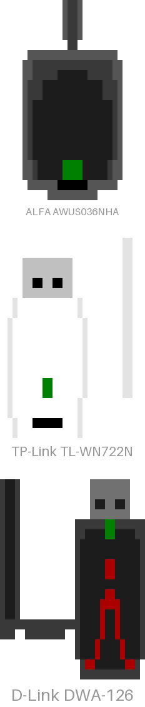
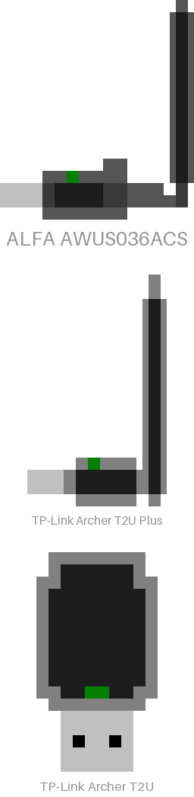
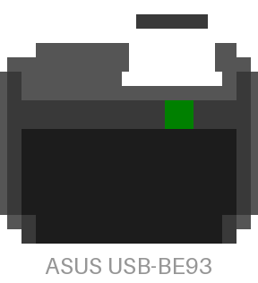
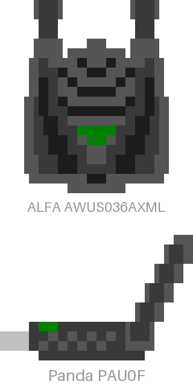
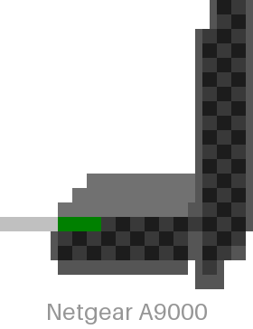
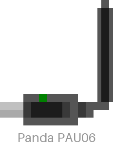

# Wifit3 Hardware Testing & Verification

The matrix below captures *how well wifit3 drives each card* right now. Every blemish is
either a documented Wifit3 bug or a hardware limitation; the deep per-card detail and history
live in each chip's `<CHIP>.md` (linked under its table).

**✅** works · **⚠️** works, with a caveat · **❌** tried, broken · **⬜** not run yet

- **RX** (receive): range, reception quality, channel tune. *Passive* captures rely on RX.
- **TX** (frame injection): Deauths, WPS, WEP, PMKID extraction, etc all rely on TX.
- **ACKs**: radio HW-ACKs a forged MAC. WPS relies heavily on Auto-ACKing, PMKID less so, Deauth/WEP not at all.
- **Port**: performance comparison to the Linux driver port (RX breadth & quality).
- **Stress**: 30-min channel-hopping soak, only tracks RX degradation over time.
- **Grade**: summary/rollup of the above metrics as a final letter grade.

## Matrix

| Chipset | RX | TX | ACKs | Port | Stress | Grade |
|---|:--:|:--:|:--:|:--:|:--:|:--:|
| [AR9271](#ar9271) | ✅ | ✅ | ✅ | ✅ | ✅ | A |
| [MT7612U](#mt7612u) | ✅ | ✅ | ✅ | ✅ | ✅ | A |
| [MT7610U](#mt7610u) | ✅ | ✅ | ✅ | ✅ | ✅ | A |
| [MT7921AU](#mt7921au) | ✅ | ✅ | ✅ | ✅ | ✅ | A |
| [MT7925AU](#mt7925au) | ✅ | ✅ | ✅ | ✅ | ✅ | A |
| [RTL8188EUS](#rtl8188eus) | ✅ | ✅ | ✅ | ✅ | ✅ | A |
| [RTL8812AU](#rtl8812au) | ✅ | ✅ | ✅ | ✅ | ✅ | A |
| [RTL8821AU](#rtl8821au) | ✅ | ✅ | ✅ | ✅ | ✅ | A |
| [RTL8922AU](#rtl8922au) | ✅ | ✅ | ✅ | ✅ | ✅ | A |
| [RTL8822BU](#rtl8822bu) | ✅ | ✅ | ✅ | ✅ | ✅ | A |
| [RT3070](#rt3070) | ✅ | ✅ | ✅ | ✅ | ✅ | A |
| [RT5372](#rt5372) | ✅ | ✅ | ✅ | ✅ | ✅ | A |
| [RT5370](#rt5370) | ✅ | ✅ | ✅ | ✅ | ✅ | B |
| [RT5572](#rt5572) | ✅ | ⚠️ | ✅ | ✅ | ✅ | B |
| [RTL8821CU](#rtl8821cu) | ⚠️ | ✅ | ✅ | ⚠️ | ✅ | B |
| [RTL8187L](#rtl8187l) | ✅ | ✅ | ⚠️ | ✅ | ✅ | C |
| [RTL8814AU](#rtl8814au) | ❌ | ✅ | ✅ | ⚠️ | ✅ | D |
| [RT2500USB](#rt2500usb) | ⚠️ | ✅ | ❌ | ✅ | ⚠️ | D |

## Atheros Chipset
### AR9271

*ALFA AWUS036NHA / TP-Link TL-WN722N / D-Link DWA-126 · 2.4 GHz*

| Capability | Status | Date | Notes |
|---|:--:|---|---|
| **Grade** | **92% (A)** | 2026-07-25 | Full 2.4 GHz attack suite, kernel-parity RX (now baselined). |
| RX | ✅ | 2026-07-25 | Ref AP 7.1 vs 7.6/s (93%); RSSI accurate; run-to-run variance at weak signal. |
| Port | ✅ | 2026-07-25 | Matches ath9k_htc: Ref AP beacon rate + RSSI parity. |
| Handshake | ✅ | 2026-07-25 | Deauth → 4-way (M1–M4). |
| PMKID | ✅ | 2026-07-25 | Passive + active extract. |
| WEP | ✅ | 2026-07-25 | ChopChop + ARP replay ~200 IVs/s. |
| WPS | ✅ | 2026-07-25 | PIN → M7 (5/5). |
| ACKs | ✅ | 2026-07-25 | Auto-ACK forged MAC via active monitor (Addr2-keyed). |
| Stress | ✅ | 2026-07-29 | 30-min 13-ch soak, flat (trend 0.91). |

→ [AR9271_V2.md](../src/wifit3/chips/ar9271_v2/AR9271_V2.md)

## Realtek Chipsets
### RTL8187L

*ALFA AWUS036H · 2.4 GHz*

| Capability | Status | Date | Notes |
|---|:--:|---|---|
| **Grade** | **71% (C)** | 2026-07-25 | Matches Linux RX + TX, limited 802.11g, hard-MAC (no auto-ACKs), 100 ivs/s WEP. |
| RX | ✅ | 2026-07-09 | ref AP 5.9 vs linux 6.7/s (88%); breadth 59 vs 54 (≥ linux); RSSI −0.9 dB. |
| TX | ✅ | 2026-07-25 | Deauth + WEP inject; live-confirmed. |
| ACKs | ⚠️ | 2026-07-25 | Hard-MAC = fixed-MAC (can't ACK spoofed MACs). |
| Port | ✅ | 2026-07-09 | Matches linux breadth (59/54 APs), RSSI −0.9 dB, worse beacon rate (5.9 vs 6.7/s = 88%). |
| Handshake | ✅ | 2026-07-25 | Deauth → 4-way. |
| PMKID | ✅ | 2026-07-25 | Passive + active. |
| WEP | ✅ | 2026-07-25 | FakeAuth + ARP replay + ChopChop; ~100 IVs/s. |
| WPS | ✅ | 2026-07-25 | PIN → M7 (4/5, via the silicon-MAC path). |
| Stress | ✅ | 2026-07-29 | 30-min 13-ch soak, flat (trend 1.06). |

→ [RTL8187L.md](../src/wifit3/chips/rtl8187/RTL8187L.md)

### RTL8188EUS

*TP-Link TL-WN722N v2/v3 · 2.4 GHz*

> Ported from the [aircrack-ng/rtl8188eus](https://github.com/aircrack-ng/rtl8188eus) vendor/DKMS
> port. There is a separate (weaker) port for the mainline kernel v6.18 driver (opt-in via
> `WIFIT3_RTL8188=mainline`), but the default DKMS port out-performs mainline (as expected).

| Capability | Status | Date | Notes |
|---|:--:|---|---|
| **Grade** | **90% (A)** | 2026-07-25 | Kernel-parity RX + full 2.4 attack suite. |
| RX | ✅ | 2026-07-09 | (DKMS) beacon rate matches Linux 7.7 vs 7.29/s, breadth 102 vs 91 (≥ linux); RSSI −0.6 dB. |
| Port | ✅ | 2026-07-09 | (DKMS) Matches Linux 98% total beacons (6570 vs 6693), breadth 102 ≥ 91, RSSI −0.6 dB. |
| Handshake | ✅ | 2026-07-25 | Deauth → 4-way. |
| PMKID | ✅ | 2026-07-25 | Active extract. |
| WEP | ✅ | 2026-07-25 | ChopChop + ARP replay ~170 IVs/s. |
| WPS | ✅ | 2026-07-25 | PIN → M7 (5/5); PBC (~20 EAPOL). |
| ACKs | ✅ | 2026-07-25 | Auto-ACK forged MAC via active monitor (Addr2-keyed). |
| Stress | ✅ | 2026-07-30 | 30-min soak, flat (trend 0.97); mainline degrades/collapses. |

→ [RTL8188EUS_DKMS.md](../src/wifit3/chips/rtl8188eus_dkms/RTL8188EUS_DKMS.md) (default) · [RTL8188EUS.md](../src/wifit3/chips/rtl8188eus/RTL8188EUS.md) (mainline)

### RTL8812AU

*ALFA AWUS036ACH · 2.4 / 5 GHz*

> **Default = vendor/DKMS port** (table below). `WIFIT3_RTL8812=mainline` opts back. But mainline
> **wedges on 2.4↔5 GHz hopping** (RF synth loses lock; confirmed 2026-07-07, ch153/161 dropped), so
> it's fixed-channel only. DKMS hops clean. *(The DKMS driver won't compile on kernel 6.19, so the
> same-driver Port baseline couldn't be re-run fresh. Port ✅ is vs the prior linux-DKMS + a clean
> live dual-band hop.)*

| Capability | Status | Date | Notes |
|---|:--:|---|---|
| **Grade** | **91% (A)** | 2026-07-25 | Clean dual-band DKMS default, full attack suite; mainline-wedge is opt-in only. |
| RX | ✅ | 2026-07-07 | DKMS ref2g 6.4/s, ref5g 9.2/s, breadth 91/40; no wedge on the dual-band hop. |
| Port | ✅ | 2026-07-07 | Clean dual-band hop; same-driver baseline stale (6.19 build fails). See note. |
| TX | ✅ | 2026-07-25 | Client drop + reconnect caught. |
| Handshake | ✅ | 2026-07-25 | M2/M4 (ToDS): crackable. |
| PMKID | ✅ | 2026-07-25 | Capture + active extract. |
| WEP | ✅ | 2026-07-25 | Replay + ChopChop. |
| WPS | ✅ | 2026-07-25 | PIN + PBC. |
| ACKs | ✅ | 2026-07-25 | HW-ACK forged MAC (WPS/PMKID). |
| Stress | ✅ | 2026-07-29 | 30-min 22-ch dual-band soak, flat (trend 1.08). |

→ [RTL8812AU_DKMS.md](../src/wifit3/chips/rtl8812au_dkms/RTL8812AU_DKMS.md) (default) · [RTL8812AU.md](../src/wifit3/chips/rtl8812au/RTL8812AU.md) (mainline)

### RTL8814AU

*ALFA AWUS1900 · 2.4 / 5 GHz · 4T4R*

> The maintainer of the DKMS driver says Realtek's support for this driver is subpar, that the
> driver itself is not good, and advises not using cards that rely on this driver
> ([morrownr/8814au#37](https://github.com/morrownr/8814au/issues/37#issuecomment-900581613)).

> **Default = vendor/DKMS port.** `WIFIT3_RTL8814=mainline` opts back.

| Capability | Status | Date | Notes |
|---|:--:|---|---|
| **Grade** | **60% (D)** | 2026-07-25 | Sometimes wedges after hopping; WEP severely limited (~10-20 IVs/s). Rest of the suite fine. |
| RX | ❌ | 2026-07-25 | Matches Linux when unwedged (6.1/5.8 beacon/s, ref5g 9.8/9.0, RSSI −0.3 dB). |
| Port | ⚠️ | 2026-07-25 | Not a faithful port; Linux does not have the wedge-after-hopping bug. |
| Handshake | ✅ | 2026-06-05 | Deauth → 4-way. |
| PMKID | ✅ | 2026-07-25 | Passive + active (2.4 + 5 GHz). |
| WEP | ⚠️ | 2026-07-25 | Replay + ChopChop, but RX-limited to ~10-20 IVs/s. |
| WPS | ✅ | 2026-07-25 | PIN → M7 (5/5). |
| ACKs | ✅ | 2026-07-25 | Auto-ACK forged MAC via active monitor (Addr2-keyed). |
| Stress | ✅ | 2026-07-29 | 30-min 22-ch flat (trend 1.04). Continuous hopping avoids wedge. |

→ [RTL8814AU.md](../src/wifit3/chips/rtw88_8814au/RTL8814AU.md) (mainline) · [RTL8814AU_DKMS.md](../src/wifit3/chips/rtl8814au_dkms/RTL8814AU_DKMS.md) (default)

### RTL8821AU

*ALFA AWUS036ACS / Archer T2U+ / Archer T2U · 2.4 / 5 GHz*

> **Default = vendor/DKMS port** (table below). `WIFIT3_RTL8821=mainline` opts back.

| Capability | Status | Date | Notes |
|---|:--:|---|---|
| **Grade** | **91% (A)** | 2026-07-25 | Clean dual-band on both variants, full attack suite, no wedge. |
| RX | ✅ | 2026-07-07 | DKMS ref2g 7.0/7.8 (90%), ref5g 9.3/9.6 (97%), breadth 66/31; mainline 91% too. |
| Port | ✅ | 2026-07-07 | Matches linux both bands, DKMS + mainline. |
| Handshake | ✅ | 2026-07-25 | Deauth → 4-way. |
| PMKID | ✅ | 2026-07-25 | Passive + active. |
| WEP | ✅ | 2026-07-25 | Replay + ChopChop. |
| WPS | ✅ | 2026-07-25 | PIN + PBC. |
| ACKs | ✅ | 2026-07-25 | HW-ACK forged MAC (WPS/PMKID). |
| Stress | ✅ | 2026-07-30 | 30-min 22-ch dual-band soak, flat (trend 1.03). |

→ [RTL8821AU.md](../src/wifit3/chips/rtl8821au/RTL8821AU.md) (mainline) · [RTL8821AU_DKMS.md](../src/wifit3/chips/rtl8821au_dkms/RTL8821AU_DKMS.md) (default)

### RTL8821CU

*Auscoumer 600 Mbps · 2.4 / 5 GHz*

| Capability | Status | Date | Notes |
|---|:--:|---|---|
| **Grade** | **B** | 2026-07-25 | Full dual-band attack suite; 2.4 GHz can come up silent after a 5→2.4 switch (until switched back). |
| RX | ⚠️ | 2026-07-25 | Matches Linux both bands on a clean connect; 2.4 GHz can go silent after a 5→2.4 switch. |
| Port | ⚠️ | 2026-07-25 | Unfaithful port: the 2.4-after-5 silence is a bug in our port, not Linux. |
| Handshake | ✅ | 2026-06-24 | 4-way captured. |
| PMKID | ✅ | 2026-06-24 | Capture + active extract (2.4 + 5). |
| WEP | ✅ | 2026-07-06 | 2.4 ChopChop + ARP replay ~225 IVs/s (no 5 GHz WEP target). |
| WPS | ✅ | 2026-06-24 | PBC: ~25 EAPOLs (HW-ACK forged MAC). |
| ACKs | ✅ | 2026-06-24 | HW-ACK forged MAC (WPS + 5 GHz PMKID/deauth). |
| Stress | ✅ | 2026-07-29 | 30-min 22-ch soak, flat (trend 0.96, no death-detect). |

→ [RTL8821CU_DKMS.md](../src/wifit3/chips/rtl8821cu_dkms/RTL8821CU_DKMS.md)

### RTL8822BU

*TP-Link Archer T3U Plus v1 · 2.4 / 5 GHz*

> **Default = vendor/DKMS port** (table below). `WIFIT3_RTL8822=mainline` opts back.

| Capability | Status | Date | Notes |
|---|:--:|---|---|
| **Grade** | **90% (A)** | 2026-07-25 | Dual-band kernel-parity RX + full attack suite. |
| RX | ✅ | 2026-07-08 | 2G: 6.5 vs 6.4/s (102%), 5G: 9.5 vs 9.7/s (99%); breadth 78/36 (2G+5G); RSSI −0.5 dB. |
| Port | ✅ | 2026-07-08 | Matches linux-DKMS (88x2bu) both bands. |
| TX | ✅ | 2026-07-25 | Deauth & PMKID extraction. |
| Handshake | ✅ | 2026-06-16 | Deauth → full M1–M4. |
| PMKID | ✅ | 2026-07-25 | Passive capture + extract. |
| WEP | ✅ | 2026-07-25 | ChopChop + ARP replay ~140 IVs/s. |
| WPS | ✅ | 2026-07-25 | PIN → M7 (5/5). |
| ACKs | ✅ | 2026-07-25 | Auto-ACK forged MAC via active monitor (spoofed + silicon). |
| Stress | ✅ | 2026-07-30 | 30-min 22-ch soak, flat (trend 0.94, no death-detect). |

→ [RTL8822BU_DKMS.md](../src/wifit3/chips/rtl8822bu_dkms/RTL8822BU_DKMS.md) (default) · [RTL8822BU.md](../src/wifit3/chips/rtl8822bu/RTL8822BU.md) (mainline)

### RTL8922AU

*ASUS USB-BE93 · 2.4 / 5 GHz · Wi-Fi 7 (rtw89 8922A)*

| Capability | Status | Date | Notes |
|---|:--:|---|---|
| **Grade** | **A** | 2026-07-30 | Accurate rtw89 port (verify_pcap PASS ×3); full attack suite works on USB-A. USB-3 starves RX (see RX). |
| RX | ✅ | 2026-07-30 | Dual-band monitor RX; yield tracks USB speed (USB-A ~70-90 APs, USB-3 ~16, 2.4 GHz worst). |
| TX | ✅ | 2026-07-30 | Deauth + WPS + PMKID inject, 2.4 + 5 GHz (probe-req drew 38 responses). |
| ACKs | ✅ | 2026-07-30 | Auto-ACKs a forged MAC via active monitor (SPOOFABLE); WPS-PIN + PMKID confirm it. |
| Port | ✅ | N/A | verify_pcap PASS on all 3 cold-boot captures (register + bulk-OUT byte-for-byte), both bands. |
| Handshake | ✅ | 2026-07-30 | Deauth → 4-way, 2.4 + 5 GHz. |
| PMKID | ✅ | 2026-07-30 | Passive + active, 2.4 + 5 GHz. |
| WEP | ✅ | 2026-07-30 | USB-A: ChopChop 32B/15s, ARP ~180 IVs/s. USB-3: ~1min/32B, ~8 IVs/s (RX-starved). |
| WPS | ✅ | 2026-07-30 | PIN works. |
| Stress | ✅ | 2026-07-29 | 30-min USB-A soak, flat (93→102 active, trend ~1.0). USB-3 drops RX to ~15 (2.4 GHz hit hardest). |

→ [RTL8922AU.md](../src/wifit3/chips/rtl8922au/RTL8922AU.md)

## Mediatek Chipsets
### MT7610U

*ALFA AWUS036ACHM · 2.4 / 5 GHz*

| Capability | Status | Date | Notes |
|---|:--:|---|---|
| **Grade** | **93% (A)** | 2026-07-25 | Faithful dual-band port, linux-parity RX, full suite. |
| RX | ✅ | 2026-07-07 | ref2g 7.1/7.3 (97%), ref5g 9.3/9.7 (96%); breadth 132/34 (best 2.4, matches). |
| Port | ✅ | 2026-07-07 | Matches mt76x0u both bands. |
| Handshake | ✅ | 2026-07-25 | Deauth → 4-way capture. |
| PMKID | ✅ | 2026-07-25 | Passive + active (2.4 + 5 GHz). |
| WEP | ✅ | 2026-07-25 | ChopChop + ARP replay ~190 IVs/s. |
| WPS | ✅ | 2026-07-25 | PIN → M7 (5/5). |
| ACKs | ✅ | 2026-07-25 | Auto-ACK forged MAC via active monitor (spoofed + silicon). |
| Stress | ✅ | 2026-07-29 | 30-min 22-ch dual-band soak, flat (trend 1.01). |

→ [MT76X0U.md](../src/wifit3/chips/mt76x0u/MT76X0U.md)

### MT7612U

*ALFA AWUS036ACM · 2.4 / 5 GHz*

| Capability | Status | Date | Notes |
|---|:--:|---|---|
| **Grade** | **93% (A)** | 2026-07-25 | Faithful dual-band port, linux-parity RX, full suite. |
| RX | ✅ | 2026-07-06 | 2G: 7.6/8.3 b/s (92%), 5G: 8.9/9.7 (92%); breadth 109/43 (matches); RSSI −1.5 dB. |
| Port | ✅ | 2026-07-06 | Matches mt76x2u both bands. |
| Handshake | ✅ | 2026-07-25 | Deauth → 4-way (M1–M4). |
| PMKID | ✅ | 2026-07-25 | Passive + active (2.4 + 5 GHz). |
| WEP | ✅ | 2026-07-25 | Replay + ChopChop ~160 IVs/s. |
| WPS | ✅ | 2026-07-25 | PIN → M7 (4/5). |
| ACKs | ✅ | 2026-07-25 | Auto-ACK forged MAC via active monitor (spoofed + silicon). |
| Stress | ✅ | 2026-07-29 | 30-min 22-ch dual-band soak, flat (trend 0.98, TSSI-on). |

→ [MT76X2U.md](../src/wifit3/chips/mt76x2u/MT76X2U.md)

### MT7921AU

*ALFA AWUS036AXML / Panda PAU0F · 2.4 / 5 GHz*

| Capability | Status | Date | Notes |
|---|:--:|---|---|
| **Grade** | **A** | 2026-07-25 | Best-in-batch RX + faithful dual-band port, full attack suite. |
| RX | ✅ | 2026-07-06 | 2G: 8.6/8.9 b/s (97%), 5G: 9.3/9.6 (97%); breadth 112/52 APs (matches); RSSI −1.4 dB. |
| Port | ✅ | 2026-07-06 | Matches mt76 both bands. |
| TX | ✅ | 2026-07-25 | Inject 2.4 + 5 GHz. |
| Handshake | ✅ | 2026-07-25 | Deauth → 4-way (M1–M4). |
| PMKID | ✅ | 2026-07-25 | Passive capture + active extract. |
| WEP | ✅ | 2026-07-25 | ChopChop + ARP replay ~220 IVs/s. |
| WPS | ✅ | 2026-07-25 | PIN → M7 (5/5, auto-ACK). |
| ACKs | ✅ | 2026-07-25 | Auto-ACK forged MAC via active monitor (spoofed MAC). |
| Stress | ✅ | 2026-07-29 | 30-min 22-ch dual-band soak, flat (trend 1.08). |

→ [MT7921AU.md](../src/wifit3/chips/mt7921au/MT7921AU.md)

### MT7925AU

*Netgear A9000 · 2.4 / 5 GHz · Wi-Fi 7 (connac3)*

| Capability | Status | Date | Notes |
|---|:--:|---|---|
| **Grade** | **A** | 2026-07-27 | Kernel-parity dual-band RX and full attack suite; flat 20-min soak. |
| RX | ✅ | 2026-07-27 | 2G: 8.9/8.71 (match), 5G: 9.8/9.79 (match); breadth = Linux; RSSI +0.1 dB. |
| Port | ✅ | 2026-07-27 | Matches mt7925u both bands; accurate RSSI. |
| TX | ✅ | 2026-07-26 | Inject 2.4 + 5 GHz; TXWI byte-exact vs 2 TX pcaps. |
| Handshake | ✅ | 2026-07-26 | Deauth → 4-way. |
| PMKID | ✅ | 2026-07-26 | Captured. |
| ACKs | ✅ | 2026-07-27 | Auto-ACKs forged MACs (via Active Monitor); HW ACK-retries. |
| WPS | ✅ | 2026-07-27 | PIN → M7, 5/5 (active monitor). |
| WEP | ✅ | 2026-07-26 | 2.4 GHz ChopChop + ARP replay ~300 IVs/s. |
| Stress | ✅ | 2026-07-29 | 30-min 22-ch soak, flat (trend 1.01, no death-detect). |

→ [MT7925AU.md](../src/wifit3/chips/mt7925au/MT7925AU.md)

## Ralink Chipsets
### RT2500USB

*Buffalo Nintendo Wi-Fi / RT2570 · 2.4 GHz*

> My first wireless card: It gets an "A" in my book simply for still working after 20 years!

| Capability | Status | Date | Notes |
|---|:--:|---|---|
| **Grade** | **D** | 2026-07-25 | RX flakey when "holding it wrong", no ACK-based retries at all (not even fixed-MAC). Beloved. |
| RX | ⚠️ | 2026-07-25 | Good when good: 8.4 vs 8.1/s Linux, RSSI −0.2. Drops to near-dead in bad spells. |
| TX | ✅ | 2026-07-25 | Deauth + PMKID + WEP inject; one copy per frame (no ACK-based retry). |
| ACKs | ❌ | 2026-07-25 | NONE: auto-ACKs nothing, not even its own silicon MAC (no active monitor / autoresponder). |
| Port | ✅ | 2026-07-25 | Matches rt2500usb RX, captured in a good spell; intermittency makes it hard to reproduce. |
| Handshake | ✅ | 2026-07-25 | Deauth → reconnect (M1–M3). |
| PMKID | ✅ | 2026-07-25 | Passive + active extract. |
| WEP | ⚠️ | 2026-07-25 | ARP ~50 IVs/s; ChopChop fails due to no ACK-based delivery. |
| WPS | ✅ | 2026-07-25 | PIN → M7 (5/5) but slow (~4.2 s median, via AP retransmits, no auto-ACK). |
| Stress | ⚠️ | 2026-07-29 | Solo: 30-min soak, mild late taper. Died at 2m in a 4-card soak (bus contention, not the driver). |

→ [RT2500USB.md](../src/wifit3/chips/rt2500usb/RT2500USB.md)

### RT3070

*ALFA AWUS036NH · 2.4 GHz · 1T1R*

Excellent 2.4 GHz front-end (external LNA): strong range, signal, and TX rate.

| Capability | Status | Date | Notes |
|---|:--:|---|---|
| **Grade** | **A** | 2026-07-25 | Full 2.4 GHz attack suite; now with a Linux baseline (kernel-parity RX). |
| RX | ✅ | 2026-07-25 | Ref AP 6.9 vs 6.6/s (matches); RSSI accurate. |
| TX | ✅ | 2026-07-25 | Deauth byte-match w/ aireplay-ng. |
| ACKs | ✅ | 2026-07-25 | Auto-ACK forged MAC via active monitor (needs it for stop-on-ACK). |
| Port | ✅ | 2026-07-25 | Matches rt2800usb: Ref AP beacon rate + RSSI parity. |
| Handshake | ✅ | 2026-07-25 | Deauth → 4-way. |
| PMKID | ✅ | 2026-07-25 | Passive + active extract. |
| WEP | ✅ | 2026-07-25 | ChopChop + ARP replay ~136 IVs/s. |
| WPS | ✅ | 2026-07-25 | PIN → M7 (5/5). |
| Stress | ✅ | 2026-07-29 | 30-min 14-ch soak, flat (trend 1.01). |

→ [RT3070.md](../src/wifit3/chips/rt3070/RT3070.md)

### RT5370

*LOTEKOO 150 Mbps · 2.4 GHz · 1T1R*

| Capability | Status | Date | Notes |
|---|:--:|---|---|
| **Grade** | **80% (B)** | 2026-07-25 | Kernel-parity RX, nano 1T1R front-end is limited (1/2 good card); WPS flaky. |
| RX | ✅ | 2026-07-08 | ref AP 8.6 vs 9.1/s (95%); breadth 50 vs 57; RSSI +0.8 dB (accurate). |
| Port | ✅ | 2026-07-08 | Matches rt2800usb: beacon rate + RSSI parity; accurate RSSI (+0.8 dB). |
| Handshake | ✅ | 2026-07-25 | Deauth → 4-way. |
| PMKID | ✅ | 2026-07-25 | Capture + active extract. |
| WEP | ✅ | 2026-07-25 | 2.4 GHz ChopChop + ARP replay ~200 IVs/s. |
| WPS | ⚠️ | 2026-07-25 | PIN → M7 but flaky (3-4/5, ~7.6 s median), imperfect stop-on-ACK. |
| ACKs | ✅ | 2026-07-25 | Auto-ACK forged MAC via active monitor (stop-on-ACK imperfect). |
| Stress | ✅ | 2026-07-30 | 30-min 14-ch soak, flat (trend 1.02, no death-detect). |

→ [RT5370.md](../src/wifit3/chips/rt5370/RT5370.md)

### RT5372

*Panda PAU05 + PAU06 · 2.4 GHz · 2T2R*

| Capability | Status | Date | Notes |
|---|:--:|---|---|
| **Grade** | **92% (A)** | 2026-07-25 | Faithful port, linux-parity RX, full attack suite, flat soak. |
| RX | ✅ | 2026-07-06 | 2G 6.6 vs 7.1/s (93%); breadth 75/79; RSSI +0.7 dB. |
| Port | ✅ | 2026-07-06 | Matches linux (rt2800usb); accurate RSSI (+0.7 dB). |
| TX | ✅ | 2026-07-25 | Live → reconnect; byte-match w/ aireplay-ng. |
| Handshake | ✅ | 2026-07-25 | Deauth → 4-way (~27 EAPOL/30 s). |
| PMKID | ✅ | 2026-07-25 | Capture + active extract. |
| WEP | ✅ | 2026-07-25 | ARP replay + ChopChop. |
| WPS | ✅ | 2026-07-25 | PIN + PBC. |
| ACKs | ✅ | 2026-07-25 | WPS PIN/PBC → auto-ACK. |
| Stress | ✅ | 2026-07-30 | 30-min 14-ch soak, flat (PAU05 1.13, PAU06 0.91). |

→ [RT5372.md](../src/wifit3/chips/rt5372/RT5372.md) (default) · [RT2800USB.md](../src/wifit3/chips/rt2800usb/RT2800USB.md) (rt2800usb fallback)

### RT5572

*Panda PAU09 N600 · 2.4 / 5 GHz · 2T2R*

> **5 GHz injection is flaky on nearby APs**: deauth / PMKID / WPS can drop on a strong nearby
> 5 GHz AP. Distant 5 GHz and all of 2.4 GHz are unaffected.

| Capability | Status | Date | Notes |
|---|:--:|---|---|
| **Grade** | **85% (B)** | 2026-07-25 | Matches Linux RX/TX, auto-ACK; 2GHz TX is fine but 5 GHz TX is flaky on *nearby* APs. |
| RX | ✅ | 2026-07-09 | 2G: 7.7/7.7 (100%), 5G: 8.6/9.7 (89%); breadth 103/109 2G, 38/38 5G; RSSI +0.3 dB. |
| TX | ⚠️ | 2026-07-25 | 2G TX good, 5G TX unreliable on nearby strong APs (TX's to distant APs fine). |
| Port | ✅ | 2026-07-25 | Matches linux (rt2800usb) both bands; accurate RSSI. |
| Handshake | ✅ | 2026-07-25 | 2.4 deauth → 4-way. |
| PMKID | ✅ | 2026-07-25 | Passive + active 2.4; 5 GHz nearby harvest limited by weak TX (a few retries). |
| WEP | ✅ | 2026-07-25 | 2.4 ChopChop + ARP replay ~200 IVs/s. |
| WPS | ✅ | 2026-07-25 | PIN → M7 (5/5); 5 GHz nearby assoc limited by TX. |
| ACKs | ✅ | 2026-07-25 | Auto-ACK forged MAC via active monitor. |
| Stress | ✅ | 2026-07-29 | 30-min 22-ch soak, flat (trend 1.04). |

→ [RT5572.md](../src/wifit3/chips/rt5572/RT5572.md)

## Unsupported

### RT3572 (ALFA AWUS051NH v2): untested

Our only unit (bought 2015) has a blank EFUSE (no factory RF calibration), so it can't
validate the chip.

→ [RT2800USB.md](../src/wifit3/chips/rt2800usb/RT2800USB.md)

## Stress soak

A **30-minute** sustained-hop soak: `scripts/rx/soak.py --skip-baseline --longrun-min 30`,
hopping all channels. ✅ = no degradation trend across the 60 s buckets *and* post-soak attacks pass.

*Why 30 min, not an hour:* across a dozen cards a 1-hour bar is a full day of hands-on
scanning, and 30 min already resolves the degradation curve.

## Hardware queue

*"Will you support card X?"* Maybe. A chipset gets added when we have the adapter in
hand **and** a clean cold-boot USB capture to port against (the process is
`docs/porting/METHODOLOGY.md`). Good candidates are the USB adapters morrownr recommends for
Kali: <https://github.com/morrownr/USB-WiFi/blob/main/home/Recommended_Adapters_for_Kali_Linux.md>

**Wishlist (not yet bought):**

- **TP-Link Archer T2U Plus**: RTL8821AU / RTL8811AU.
- **Generic MT7601U**: cheapest dongle; known for awkward packet injection.
